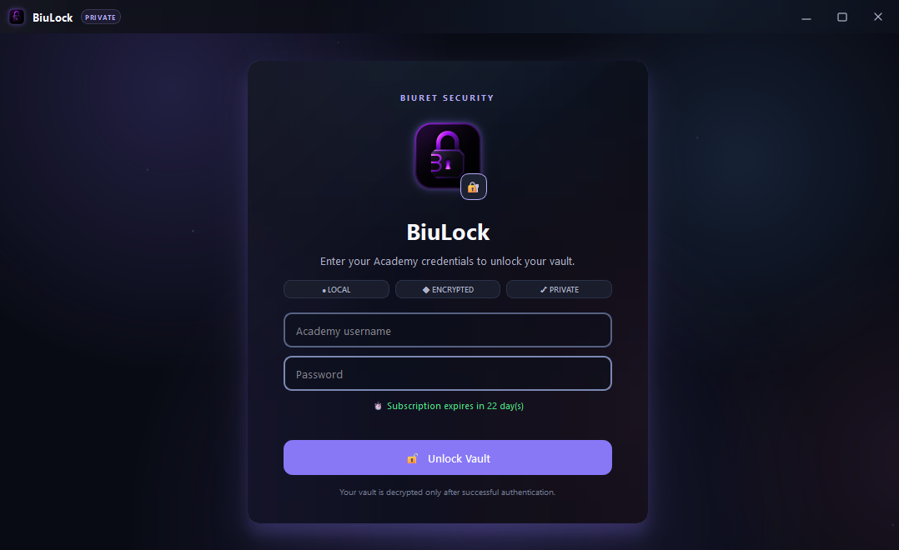

# 🔐 BiuLock

### Secure. Local. Encrypted.

A security-focused password manager built with **Python & PyQt6** for securely managing credentials in an encrypted local vault.

 

---

## 🖥️ Preview

---

## 🛡️ About BiuLock

**BiuLock** is a desktop password manager designed with security and privacy in mind.

It provides an encrypted local vault for storing and managing credentials through a modern desktop interface. Access to the vault is protected through authentication, ensuring that stored credentials are only decrypted after successful login.

The project was built as part of my journey in **cybersecurity and secure software development**, combining practical security concepts with Python application development.

---

## ✨ Features

- 🔐 Encrypted credential storage
- 🖥️ Modern desktop interface
- 🔑 Protected vault authentication
- 📂 Local credential storage
- 🔍 Search and organize saved credentials
- 📋 Quick credential copying
- ⏱️ Automatic vault locking
- 🔒 Vault decryption only after successful authentication
- 👤 Integration with Biuret Academy authentication
- ⏳ Subscription validation

---

## 🔒 Security

BiuLock is designed around several security principles:

- Credentials are stored in an **encrypted format**
- Vault data remains encrypted while locked
- Decryption occurs only after successful authentication
- Sensitive data is stored locally
- Automatic locking helps protect unattended sessions

> **Note:** BiuLock is an educational cybersecurity project and is under active development. It should not be considered a replacement for professionally audited password managers.

---

## 🛠️ Built With

- **Python** — Core application logic
- **PyQt6** — Desktop graphical interface
- **Cryptography** — Encryption and security operations

---

## 🚧 Project Status

BiuLock is currently under development.

New security improvements, features, and interface enhancements may be added as the project evolves.

---

### 🛡️ Built with security in mind.

**Developed by [Adam Hamdan](https://github.com/Biuret7)**

